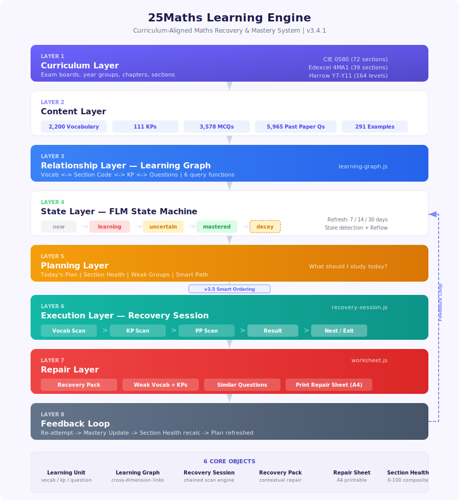

# 25Maths Learning Engine Architecture

> System blueprint as of v3.4.1 (2026-03-10)

## Mission

25Maths is not a question bank or vocabulary website. It is a **curriculum-aligned learning engine** that connects questions, vocabulary, knowledge points, recovery sessions, and printable repair sheets into one continuous mastery loop.

> 25Maths 不只是一个题库或词汇网站，而是一个基于课纲的学习引擎。它将题目、词汇、知识点、复查流程和可打印修复单连接成一个连续的掌握闭环。

---

## Architecture Diagram



---

## 1. Core Layers

The system is organized into 8 layers, each with a clear responsibility:

```
Layer 1  Curriculum Layer
         (Exam Boards / Year Groups / Sections)
              |
Layer 2  Content Layer
         (Vocabulary / Knowledge Points / Questions / Past Papers / Examples)
              |
Layer 3  Relationship Layer
         (Learning Graph)
              |
Layer 4  State Layer
         (FLM / Mastery / Stale / Mistakes / Reflow)
              |
Layer 5  Planning Layer
         (Today's Plan / Section Health / Weak Groups)
              |
Layer 6  Execution Layer
         (Recovery Session / Practice / Refresh Scan)
              |
Layer 7  Repair Layer
         (Recovery Pack / Print Repair Sheet)
              |
Layer 8  Feedback Loop
         (Return by ID / Re-attempt / Status Update)
```

Each layer answers one question:

| Layer | Question |
|-------|----------|
| **1. Curriculum** | What chapter / section / syllabus point is the student working on? |
| **2. Content** | What are the learning objects to study? |
| **3. Relationship** | How are questions, vocabulary, and knowledge points connected? |
| **4. State** | How well does the student currently know each item? |
| **5. Planning** | What should the student do today? |
| **6. Execution** | How does the student do it right now? |
| **7. Repair** | What happens when something is wrong? |
| **8. Feedback** | How does the system know the student improved? |

---

## 2. Core Objects

Six formal objects define the system's vocabulary. All development and documentation should use these terms consistently.

### 2.1 Learning Unit

The smallest trackable learning object. Three types:

| Type | Example | FLM Tracked |
|------|---------|-------------|
| **Vocabulary** | "integer", "coefficient" | Yes — per-word scan |
| **Knowledge Point (KP)** | "1.3 Squares, cubes, roots" | Yes — session-based |
| **Question** | Past paper Q or MCQ practice item | Yes — per-question |

### 2.2 Learning Graph

Runtime cross-referencing between Learning Units via shared section codes:

```
Vocabulary <-------> Section Code <-------> Knowledge Points
     |                    |                       |
     |                    v                       |
     +----------> Past Paper Questions <----------+
```

Implemented in `learning-graph.js` with 6 query functions:

| Function | Purpose |
|----------|---------|
| `lgGetVocabForSection(sectionId)` | All vocabulary words in a syllabus section |
| `lgGetKPsForSection(sectionId)` | All knowledge points in a section |
| `lgGetQuestionsForSection(sectionId)` | All past paper questions tagged to a section |
| `lgGetRelatedVocab(questionId)` | Vocabulary linked to a specific question |
| `lgGetRelatedKPs(questionId)` | Knowledge points linked to a question |
| `lgGetSimilarQuestions(questionId)` | Questions in the same section/subtopic |

### 2.3 Recovery Session

A chained sequence of refresh scans launched from Today's Plan. Currently: `vocab -> KP -> PP` with step indicator bar, result panels, and Next/Exit controls.

### 2.4 Recovery Pack

A contextual repair bundle shown when a student rates a question as "needs work":

```
+-- Recovery Pack ----------------------------------+
|                                                    |
|  Weak Vocabulary      -> Opens vocab deck          |
|  Related KPs          -> Opens KP detail page      |
|  Similar Questions    -> Same-subtopic items       |
|  Print Repair Sheet   -> A4 worksheet              |
|                                                    |
+----------------------------------------------------+
```

### 2.5 Repair Sheet

A single-question A4 printable worksheet generated by `worksheet.js`. Contains: question text, related vocabulary, related KP summary, blank working space, self-correction section. Rendered with KaTeX and inline CSS in a new window.

### 2.6 Section Health

A 0-100 composite score computed by `getSectionHealth(sectionId)`:

```
health = vocabScore  x 0.25
       + practiceScore x 0.25
       + knowledgeScore x 0.25
       + ppScore x 0.25
```

FLM-weighted sub-scores: mastered=1.0, uncertain=0.5, learning=0.2, new=0.0.

Drives: home page recommendations, Smart Path weak-section highlighting, recovery item prioritization.

---

## 3. Layer Details

### Layer 1: Curriculum

The system's organizational backbone. Not UI — content structure.

| Board | Code | Sections |
|-------|------|----------|
| CIE IGCSE Mathematics | 0580 | 9 chapters, 72 sections |
| Edexcel IGCSE Mathematics | 4MA1 | 6 chapters, 39 sections |
| Harrow Haikou Y7-Y11 | HHK | 5 year groups, 164 levels |

Sections are the join key between vocabulary, KPs, questions, and past papers.

### Layer 2: Content

| Object | Count | Source |
|--------|-------|--------|
| Vocabulary words | 2,200 | `data/levels.js` (auto-generated from .tex) |
| Knowledge Points | 72 CIE + 39 Edexcel | `data/knowledge-*.json` |
| Practice MCQs | 3,578 | `data/practice-*.json` |
| Past Paper Questions | 5,965 (4,110 CIE + 1,855 Edexcel) | `data/papers-*.json` |
| Worked Examples | 291 (CIE Ch1) | Embedded in knowledge data |

### Layer 3: Relationship (Learning Graph)

See [2.2 Learning Graph](#22-learning-graph) above. Runtime query layer using section code joins. No pre-computed graph — all lookups are O(n) scans with small n per section.

### Layer 4: State (FLM State Machine)

All three Learning Unit types share one 4-state model:

```
new --> learning --> uncertain --> mastered
         ^             |              |
         |             v              v (decay)
         +-- learning <--        uncertain
```

| Dimension | Transition Trigger | cs Definition |
|-----------|-------------------|---------------|
| **Vocabulary** | Per-word scan (Know/Fuzzy/Don't know) | Per-word correct streak |
| **KP** | Session batch (saveKPResult) | Consecutive sessions >= 85% accuracy |
| **PP** | Practice: manual cs++; Exam: high-confidence -> mastered | Per-question correct streak |

**Mastered Decay**: `REFRESH_INTERVALS = [7, 14, 30]` days. `rc` (refresh count) increments on successful refresh. `MAX_RC = 2`. When `daysSinceReview > REFRESH_INTERVALS[rc]`, item becomes stale.

**Storage**:

| Data | Location | Cloud Sync |
|------|----------|------------|
| Vocab progress | `localStorage:wmatch_v3` | Supabase `vocab_progress` |
| KP mastery | `wmatch_v3._kpMastery` | Supabase bridge field |
| PP mastery | `localStorage:pp_mastery` | Supabase `_ppMastery` bridge |
| Mode completion | `wmatch_v3.modeDone` | Cloud sync |
| Wrong book | `localStorage:pp_wrong_book` | Local only |

### Layer 5: Planning

Converts state into "what to do today":

| Component | Role |
|-----------|------|
| `getStaleWords()` | Detect decayed vocabulary |
| `getStaleKPs(board)` | Detect decayed knowledge points |
| `getStalePPQuestions(board)` | Detect decayed past paper questions |
| `ppGetWeakGroups(board)` | Identify weak question-type clusters |
| `getSectionHealth(sectionId)` | Rank sections by composite health |
| Today's Plan panel | Aggregate dashboard with badges and action buttons |
| Hero recommendation | Home page "start here" suggestion |

### Layer 6: Execution

Launches actual learning activities:

| Component | Trigger |
|-----------|---------|
| Vocabulary Refresh Scan | `startRefreshScan(words)` |
| KP Refresh Scan | `startKPRefreshScan()` |
| PP Refresh Scan | `startPPRefreshScan()` |
| Recovery Session | `startRecoverySession()` — chains all three |
| Practice mode | MCQ quiz from practice data |
| Exam mode | Timed full-paper simulation |

**Recovery Session flow (v3.4.1)**:

```
buildRecoverySession()
  |
  +-- getStaleWords()       -> queue item { type: 'vocab' }
  +-- getStaleKPs(board)    -> queue item { type: 'kp' }
  +-- getStalePPQuestions() -> queue item { type: 'pp' }

startRecoverySession()
  |
  +-- _runCurrentRecoveryItem()
  |     +-- startRefreshScan()   / startKPRefreshScan()   / startPPRefreshScan()
  |
  +-- [Scan with step bar: Vocabulary > KP > PP]
  |
  +-- [Finish hook: render result panel + replace buttons]
  |     +-- _recordRecoveryResult(type)
  |     +-- Session buttons: "Next: KP ->" or "Finish Recovery" + "Exit Recovery"
  |
  +-- _advanceRecoverySession()   [user clicks Next]
  |
  +-- _endRecoverySession()       [summary toast + navTo plan]
```

### Layer 7: Repair

Activated when a student identifies a gap:

1. **Recovery Pack** — contextual bundle of weak vocab, related KPs, similar questions (see [2.4](#24-recovery-pack))
2. **Print Repair Sheet** — A4 worksheet for paper-based correction (see [2.5](#25-repair-sheet))

### Layer 8: Feedback Loop

Results flow back into the State Layer:

```
Question Attempt
      |
  Wrong / Needs Work
      |
  Learning Graph lookup
      |
  Recovery Pack
      |
  Vocabulary / KP / Similar Question
      |
  Print Repair Sheet
      |
  Paper Correction
      |
  Return by ID
      |
  Retry / Refresh
      |
  Mastery Update (FLM state change)
      |
  Section Health recalculated
      |
  Today's Plan updated
```

This closes the loop: every learning action feeds back into detection and planning.

---

## 4. Module Map

```
config.js            Constants, theme, board detection, i18n
levels.js            Vocabulary data (auto-generated by extract-vocab.py)
storage.js           FLM state machine, cloud sync, mode tracking, stale detection
study.js             Vocab + KP scan mode (FLM three-button cycle + refresh scan)
practice.js          PP engine: practice/exam/refresh scan + wrong book
learning-graph.js    Cross-dimension query layer (6 functions)
recovery-session.js  Recovery Session orchestration + step bar + session buttons
worksheet.js         Print Repair Sheet generator
syllabus.js          Syllabus navigation + Today's Plan + section health dashboard
mastery.js           Home dashboard + deck detail + mode selection
ui.js                Panel navigation, toast, modal, language toggle
auth.js              Login/register/guest + settings + board selection
quiz.js              Four-choice quiz + Daily Challenge
spell.js             Spelling mode (Web Speech API)
match.js             Simple pair matching
battle.js            Timed matching battle
review.js            Review dashboard
stats.js             Statistics, heatmap, trend chart
export.js            Import/export (CSV/JSON/Markdown/Anki TSV)
admin.js             Teacher management (classes, students, grades)
vocab-admin.js       Super-admin vocabulary CRUD
homework.js          Homework assignments + notifications (lazy-loaded)
app.js               Init, deep linking, iOS share recovery
```

---

## 5. Version Timeline (Learning Engine milestones)

```
v2.6.0   FLM state machine (vocabulary)
v2.7.0   Mastered decay + error-driven reflow
v2.9.0   KP FLM integration (Learning Unit Phase 1)
v3.0.0   PP FLM integration (Learning Unit Phase 2)
v3.1.0   Unified Learning Unit API
v3.2.0   Learning Graph query layer
v3.2.1   Recovery Pack interaction
v3.3.0   Print Repair Sheet
v3.4.0   Recovery Session engine
v3.4.1   Recovery Session UX polish (step bar + Next/Exit)
v3.5.0   Smart Recovery Ordering (planned)
```

---

## 6. Next: Smart Recovery Ordering (v3.5)

### Current Limitation

Recovery Session uses fixed ordering: `vocab -> kp -> pp`. A student with 3 critically overdue PP questions and 15 mildly stale vocabulary words still starts with all 15 vocab words before touching the urgent questions.

### Target

Replace fixed ordering with priority-scored items. The session becomes an intelligent bridge between the Planning Layer and the Execution Layer.

### Recovery Priority Model

#### 6.1 Data Collection

`buildRecoverySession()` collects ALL stale items into a unified pool:

```
buildRecoverySession()
  |
  +-- getStaleWords()         -> [{type:'vocab', id, key, ...stateFields}]
  +-- getStaleKPs(board)      -> [{type:'kp',    id, ...stateFields}]
  +-- getStalePPQuestions()    -> [{type:'pp',    qid, ...stateFields}]
  |
  +-- Normalize into unified items with common fields:
  |     { type, id, daysSinceReview, expectedInterval,
  |       recentErrors, failCount, sectionId, rc }
  |
  +-- Score each item
  +-- Sort by priority DESC
  +-- Group into type-coherent batches
```

#### 6.2 Scoring Formula

```
Priority Score = Error Weight + Decay Weight + Exam Weight + Health Penalty
                 (0-45)         (0-35)         (0-20)        (0-15)
                                                              max = 115
```

**Error Weight** (0-45): Recent failure frequency. Items the student keeps getting wrong are most urgent.

```javascript
// recentErrors = errors in last 14 days (from fail count delta)
errorW = Math.min(recentErrors * 15, 45);
```

**Decay Weight** (0-35): How far past the expected refresh interval. More overdue = more urgent.

```javascript
// overdue = daysSinceReview - REFRESH_INTERVALS[rc]
overdueDays = Math.max(0, daysSinceReview - expectedInterval);
decayW = Math.min(overdueDays * 3, 35);
```

**Exam Weight** (0-20): Syllabus importance. Frequently-examined sections get priority.

```javascript
// examFrequency = question count in section / total questions (0-1 normalized)
examW = (examFrequency || 0.5) * 20;
```

**Health Penalty** (0-15): Items from unhealthy sections get a boost.

```javascript
// sectionHealth = getSectionHealth(sectionId), 0-100
healthPenalty = Math.max(0, 15 - Math.floor(sectionHealth / 7));
```

#### 6.3 Grouping Strategy

Pure priority sorting would create jarring type switches (vocab -> pp -> vocab -> kp). Instead, after scoring:

1. Sort all items by priority DESC
2. Split into type buckets, preserving relative priority order within each bucket
3. Determine batch order by highest-priority item in each bucket
4. Present as type-coherent batches: e.g. `[PP batch] -> [Vocab batch] -> [KP batch]`

```
Example:
  PP-Q42   score 95    \
  PP-Q17   score 82     }  PP batch (first: highest item)
  PP-Q31   score 71    /
  Vocab-A  score 88    \
  Vocab-D  score 61     }  Vocab batch (second)
  Vocab-F  score 44    /
  KP-C     score 74    }  KP batch (third)
```

The step bar then shows: `Past Papers > Vocabulary > Knowledge Points`

#### 6.4 Implementation Plan

| Change | File | Description |
|--------|------|-------------|
| `_scoreRecoveryItem(item)` | recovery-session.js | Compute priority score |
| `_normalizeStaleItems()` | recovery-session.js | Unified item format from 3 sources |
| `_groupByType(scored)` | recovery-session.js | Type-coherent batch grouping |
| Modify `buildRecoverySession()` | recovery-session.js | Use scored + grouped queue |
| Add `recentErrors` field | storage.js | Track error count in 14-day window |
| Add `examFrequency` lookup | syllabus.js or practice.js | Section question count ratio |

#### 6.5 Fallback

If scoring data is incomplete (e.g. no exam frequency data for HHK board), fall back to the current fixed ordering. The system should degrade gracefully.

This transforms Recovery Session from a **task runner** into a **learning engine**.

---

## 7. Exam Board Coverage

| Board | Code | Sections | Vocabulary | Practice MCQs | Past Paper Qs |
|-------|------|----------|-----------|---------------|---------------|
| CIE IGCSE Mathematics | 0580 | 72 | ~1,300 | 884 | 4,110 |
| Edexcel IGCSE Mathematics | 4MA1 | 39 | ~500 | 576 | 1,855 |
| Harrow Haikou Y7-Y11 | HHK | 164 levels | ~400 | 55 | -- |

---

*Canonical reference for the 25Maths Learning Engine. Update as the system evolves.*
